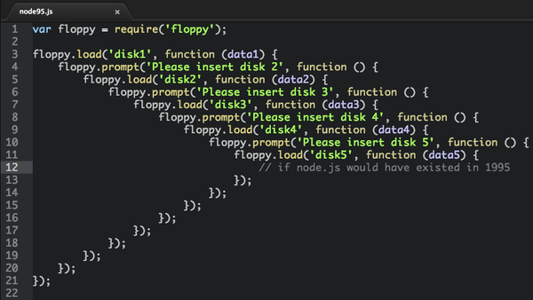

# Lập trình bất đồng bộ (async programming), callback, Promise, async-await

>**Lập trình bất đồng bộ cũng giống như một lời hứa**

Để hiểu đơn giản hãy hình dung ta đi vào một quán cafe, hiện tại có 2 kiểu thanh toán thường gặp nhất:

- Kiểu lotte (lập trình đồng bộ): Vào quầy chọn món và `chờ` để đi vào bàn. Và chúng ta sẽ hiện tượng những một dãy người đứng chờ phí, và đây gọi là `block main thread`.
- Kiểu coffee house (lập trình bất đồng bộ): Tới quầy, gọi cho anh một cốc cafe cực mạnh, thanh toán rồi ôm một cái `số` và đi kiếm bàn ngồi. Một lúc sau sẽ có người mang cafe tới.

Ở kiểu coffee house, ta có một `callback` hoặc `Promise` sẽ được gọi khi mà cafe đã được làm xong.

Chúng ta có thể hình dung trong code như sau:

```javascript
function goiCafe('ly_cf_cực_mạnh', function callback() {
  do('Mang đến bàn 12 giúp mình bạn gái xinh xinh ơi :D');
});
```

Lấy một ví dụ khác về sử dụng callback.

```javascript
// Do javascript bất đồng bộ chúng ta không thể thực hiện như sau
// chiến lược cưa gái
ket_ban_facebook("Hot gir hoa"); // gặp nàng là hot girl chờ cả năm vẫn chưa có
tha_thinh("rất nhiều thính ở đây"); // không kết bạn thả tính sao nó biết
ru_gai_di_choi(); // phải chắc đã đớp thính mới rủ đi chơi được
to_tinh(); // đi chơi nhiều thân mới dám tỏ tỉnh

// Nên mình phải viết như sau
ket_ban_facebook(funcion (isKetban) {
  if (isKetban) {
    tha_thinh("*_*", function() {
      ru_gai_di_cho(function() {
        to_tinh();
      });
    });
  }
})
```

Code của chúng ta bắt đầu trở nên phức tạp, chồng chéo lên nhau, (và đây gọi là **callback hell**)
What the F*CK!!!


Để giải quyết vấn đề này, các đấng đã ban cho chúng ta một nàng khác **Promise**

**Hứa thật nhiều, thất hứa cũng thật nhiều**

Khi hứa chúng ta sẽ có 3 trạng thái: một là mới khởi và 2 trường hợp còn lại HOẶC là thành công HOẶC là thất bại.

- **pending**: Mới hứa suông, chưa bắt đầu thực hiện.
- **fulfilled**: Đã thực hiện lời hứa.
- **reject**: Bị xù rồi.

Lúc 12, bố hứa đậu đại học đi con, có **Lamborghini**. Lúc này cái bạn nhận được là một `Promise` chứ không phải là chiếc **Lamborghini**.

```javascript
function hua_mua_xe() {
  return new Promise((thuc_hien_loi_hua, that_hua) => {
    // Mấy chục năm sau khi đậu đại học
    // Nếu thấy vui thì mua
    if (vui) {
      thuc_hien_loi_hua("Lamborghini Aventador");
      // lúc này trạng thái của lời hứa là fulfilled
    } else {
      that_hua();
      // lúc này trạng thái của lời hứa là rejectd
    }
  })
}

// đang hứa suông (pendding)
const promise = hua_mua_xe();

// bắt đầu chờ
promise
  // chờ thành công (fulfilled)
  .then((lamborghini) => {
    di_kua_gai(lamborghini);
  })
  // bị xù rồi
  .catch(() => {
    o_nha_lam_ban_voi_macbook();
  })
```

Nếu bạn tinh ý thì bạn sẽ thấy promise bản chất cũng sử dụng callback. Nhưng, nó bo thêm vài tính năng:

- Hổ trợ `chaining`
- Dễ bắt lỗi hơn.

### Hỗ trợ `chaining`

Trở về ví dụ với ví dụ cưa gái

```javascript
ket_ban_facebook()
  .then((isKetban) => {
    if (isKetban) {
      return tha_thinh("*_*");
    }
  })
  .then(ru_gai_di_cho)
  .then(to_tinh)
  .then(() => {
    /* abc xyz */
  });
})
```

### Dễ bắt lỗi hơn

Chỉ cần một trong các hàm bị `xù` (`reject`) thì hàm `callback` trong catch sẽ được gọi.

```javascript
ket_ban_facebook()
  .then((isKetban) => {
    if (isKetban) {
      return tha_thinh("*_*");
    }
  })
  .then(ru_gai_di_cho)
  .then(to_tinh)
  .then(() => { /* abc xyz */})
  .cacth((err) => {
    console.log("Đổi qua em hot gơn khác");
  });
})
```

## Async/Await

Đơn giản hóa promise và bất đồng bộ bây giờ không còn là nỗi lo nữa.

- Hàm async trả về một Promise.
- Sử dụng `try/catch` để bắt lỗi.

```javascript
// key word `async` ở đầu function

async function kua_gai(ten_gai) {
  try {
    const isKetban = await ket_ban_facebook();
    // khi kết hot gơn đồng ý thì thực hiện tiếp
    if (isKetban) {
      await tha_thinh("*_*");
      // thả thính thành công
      await ru_gai_di_choi();
      // đi chơi nhiều lần
      await to_tinh();
      // tỏ tỉnh thành công
      // abc xyz
    }
  } catch (err) {
    console.log(err);
    console.log("Đổi qua em hot gơn khác");
  }
}

kui_gai("Hoa") // async function trả về một Promise
  .then(() => {
    // abxc xyz
  });
```

Async/Await cũng sử dụng được cho arrow function

```javascript

// Có thể dùng cho arrow function luôn
const kua_gai = async (ten_gai) => {
  try {
    const isKetban = await ket_ban_facebook();
    // abc ... xyz
  } catch (err) {
    //
  }
};
```
